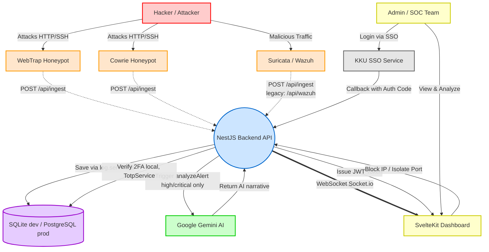

# 🏗️ KKUSIEM Architecture & Project Structure

ไฟล์นี้อธิบายโครงสร้างโปรเจกต์ (Folder Structure) และสถาปัตยกรรมระบบ (System Architecture) ของ KKUSIEM สำหรับนักพัฒนาที่เข้ามาต่อโค้ด

---

## 📂 โครงสร้างโฟลเดอร์หลัก (Project Structure)

```text
Demo_Honeypot/
│
├── backend/                     # 🔴 NestJS Backend API & WebSocket
│   ├── src/
│   │   ├── entities/            # โครงสร้างฐานข้อมูล (TypeORM)
│   │   │   ├── user.entity.ts / login-session.entity.ts
│   │   │   ├── attack.entity.ts / api-log.entity.ts
│   │   │   ├── audit-log.entity.ts / export-audit.entity.ts / report.entity.ts
│   │   │   ├── system-config.entity.ts
│   │   │   └── webhook-config.entity.ts / webhook-delivery.entity.ts
│   │   ├── api-log/              # โมดูลแยกเดี่ยว (module-per-feature เต็มรูปแบบ ไม่ใช่ flat)
│   │   │   ├── api-log.controller.ts / api-log.middleware.ts / api-log.module.ts
│   │   ├── app.module.ts         # โมดูลหลัก รวม Controller/Provider ทั้งหมด
│   │   ├── attacks.controller.ts # CRUD attack, block/isolate IP, endpoint AI (briefing/triage/nl-search)
│   │   ├── ingest.controller.ts  # POST /api/ingest — endpoint หลักสำหรับรับ log (auto-detect source)
│   │   ├── wazuh.controller.ts   # Legacy shim: /api/wazuh → forward เข้า LogService เหมือน /api/ingest
│   │   ├── log.service.ts        # 🧠 Detection & Scoring Engine (rule-based, ดูหัวข้อ AI ด้านล่าง)
│   │   ├── ai.service.ts         # เรียก Gemini (มี fallback rule-based เสมอ)
│   │   ├── auth.controller.ts    # Login, SSO callback, 2FA, user management
│   │   ├── auth.guard.ts / roles.guard.ts  # JWT guard + @Roles('admin') guard
│   │   ├── totp.service.ts       # ออก/ตรวจ TOTP secret สำหรับ 2FA
│   │   ├── crypto.service.ts     # เข้ารหัส/ถอดรหัสค่าที่เก็บใน DB (เช่น secret ต่างๆ)
│   │   ├── audit.controller.ts / audit.service.ts   # Audit log การกระทำของผู้ใช้
│   │   ├── export.controller.ts / export.service.ts # Export PDF/report + ประวัติการ export
│   │   ├── cve.controller.ts     # ดึงข้อมูล CVE ตาม id
│   │   ├── webhook.controller.ts / webhook.service.ts # Webhook out (Slack/Teams เป็นต้น)
│   │   ├── settings.controller.ts # ตั้งค่าระบบ, AI proxy, จัดการ user (แอดมิน)
│   │   ├── events.gateway.ts     # Real-time WebSocket (Socket.io)
│   │   └── seed.service.ts       # สร้าง user เริ่มต้น (admin/guest) + ตัวอย่าง attack ตอน DB ว่าง
│   ├── .env                      # ตั้งค่าตัวแปร (DB, SSO, Keys) — ไม่ commit ขึ้น git
│   └── database.sqlite           # ฐานข้อมูล SQLite fallback ตอน dev local (ถูก ignore จาก Git)
│
├── frontend/                     # 🟢 SvelteKit Frontend Dashboard
│   ├── src/
│   │   ├── lib/
│   │   │   ├── components/       # UI (กราฟ, ตาราง, โมดอล AI, ai-analyst/*)
│   │   │   ├── ReportEngine/     # Report Wizard (templates, schemas, AI narrative ฝั่ง frontend)
│   │   │   └── utils/            # ฟังก์ชันช่วยเหลือ (kkuai.ts, แปลงเวลา, export PDF)
│   │   ├── routes/
│   │   │   ├── callback/         # รับการเชื่อมต่อกลับจาก KKU SSO
│   │   │   ├── dashboard/        # หน้าแผงควบคุมหลัก (ดูรายการหน้าด้านล่าง)
│   │   │   └── +page.svelte      # หน้าล็อกอินหลัก (รองรับ SSO และ 2FA)
│   │   └── stores/
│   │       └── events.ts         # เก็บ State และเชื่อม WebSocket กับ Backend
│   └── .env                      # ตั้งค่า URL ชี้ไปยัง Backend
│
├── honeypots/                    # 🪤 ระบบล่อลวง (Decoys)
│   ├── cowrie/                   # SSH/Telnet Honeypot (ยิง log ผ่าน HTTP POST → backend)
│   └── webtrap/                  # สคริปต์ดักจับ Web-based Attacks
│
├── detection-engine/              # 🧪 FastAPI (Python) — Detection Engine เวอร์ชันทดลอง
│                                  #   มี rule engine, mock ML (XGBoost/IsolationForest), correlation,
│                                  #   IOC/threat-intel engine ในตัว — **ยังไม่ได้เชื่อมกับ backend/docker-compose จริง**
│                                  #   (ไม่มี service ใน docker-compose.yml, ไม่มีการเรียกจาก NestJS)
│                                  #   ถือเป็นโปรเจกต์คู่ขนาน/PoC แยกจาก pipeline หลักที่ใช้งานจริงใน log.service.ts
│
├── tools/attacker/                # 🎯 Attack Simulator สำหรับ Demo/Testing (profile "attacker" ใน docker-compose)
├── nginx/                         # 🛡️ Reverse Proxy + SSL config (Production)
├── docs/                          # 📝 เอกสารโปรเจกต์เพิ่มเติม
├── docker-compose.yml             # Deploy เต็มระบบ: nginx, frontend, backend, postgres, redis, cowrie, webtrap, attacker
└── README.md                      # 📖 คู่มือติดตั้ง/ใช้งานแบบย่อ
```

### หน้า Dashboard ปัจจุบัน (`frontend/src/routes/dashboard/`)
`monitor`, `analytics`, `hunting`, `explorer`, `mitre`, `network-map`, `outbound-monitor`, `credential-intel`, `cve`, `scorecard`, `blocked_ip_audit`, `archive`, `ai-briefing`, `soar`, `settings`, `account`

> ⚠️ หน้า `api-history` และ `audit` เวอร์ชันเก่าถูกลบออกแล้ว — งาน audit log ปัจจุบันย้ายไปให้ backend endpoint ของ `audit.controller.ts` รับผิดชอบ ตรวจสอบใน `frontend/src/routes/dashboard/` จริงก่อนอ้างอิงเสมอ เพราะหน้าเหล่านี้เพิ่ม/ลบบ่อย

---

## 📐 สถาปัตยกรรมระบบ (System Architecture)

Event-Driven Architecture ควบคู่กับ Client-Server Model เพื่อรองรับการแสดงผลแบบ Real-time:



### คำอธิบาย Data Flow
1. **Attack Ingestion**: Honeypot/IDS ส่ง log JSON มาที่ `POST /api/ingest` (endpoint หลัก, auto-detect source) — `/api/wazuh` ยังใช้ได้เพื่อ backward-compat แต่ forward ไป path เดียวกัน
2. **Processing & Storage**: `log.service.ts` ให้คะแนน/จำแนกประเภทแบบ rule-based แล้วบันทึกลง DB (SQLite ตอน dev local, PostgreSQL ตอนรันผ่าน `docker-compose` ที่มี `DATABASE_URL`) — ดู `app.module.ts` สำหรับ logic เลือก DB
3. **Real-time Broadcast**: บันทึกเสร็จ broadcast ผ่าน Socket.io ไปที่ Frontend ทันที **ก่อน** ที่ AI (ชั้น 2) จะวิเคราะห์เสร็จด้วยซ้ำ — dashboard เห็น event ทันทีเสมอไม่ต้องรอ AI
4. **Authentication (Hybrid)**: SOC Team login ผ่าน KKU SSO → ถ้าบัญชีเปิด 2FA ไว้ (`totp.service.ts`) ต้องกรอกรหัส 6 หลักก่อนได้ JWT
5. **Mitigation**: SOC Team บล็อก IP / isolate port จาก Frontend ผ่าน `attacks.controller.ts`

> 📝 `detection-engine/` (Python/FastAPI) เป็นโปรเจกต์ทดลองที่มี rule + mock-ML pipeline ของตัวเอง แต่ **ไม่ได้อยู่ใน data flow ข้างต้น** — ไม่มี service ใน `docker-compose.yml` และไม่มีจุดใดใน backend เรียกไปที่ port ของมัน ถ้าจะรวมเข้าระบบจริงต้องต่อสายเพิ่ม (ยังไม่มีอยู่ ณ วันนี้)

---

## 🧪 คำแนะนำการทำงาน (Dev Conventions, Commands & Testing)

### ▶️ คำสั่งที่ใช้บ่อย (Dev Commands)

**Backend** (`cd backend`, NestJS + TypeORM):
```bash
npm run start:dev     # รันแบบ watch mode (ใช้ตอนพัฒนา) — listen ที่ port 5000 ปกติ (process.env.PORT ?? 5000)
npm run build         # build เป็น dist/
npm run lint          # eslint --fix ทั้ง src/
npm run format        # prettier --write ทั้ง src/ และ test/
npm run test          # unit test ด้วย jest
npm run test:cov      # unit test พร้อม coverage
npm run test:e2e      # e2e test (config: test/jest-e2e.json)
```

**Frontend** (`cd frontend`, SvelteKit + Vite):
```bash
npm run dev      # vite dev --host (dev server, http://localhost:5173)
npm run build    # vite build
npm run check    # svelte-check --tsconfig ./tsconfig.json (type-check ทั้ง .ts/.svelte)
```

> ไม่มีคำสั่ง `npm run test` ในฝั่ง frontend — ยังไม่ได้ตั้ง test runner ไว้

### 📏 Coding Conventions

- **Backend**: บังคับด้วย ESLint (`eslint.config.mjs`) + Prettier (`.prettierrc`: `singleQuote: true`, `trailingComma: "all"`). กฎที่เปิดเป็น `warn` เท่านั้น (ไม่ fail build): `no-floating-promises`, `no-unsafe-argument`. `no-explicit-any` ปิดไว้ — โค้ด backend ใช้ `any` กับ payload ที่มาจากหลายแหล่ง (Cowrie/Wazuh/WebTrap) ได้ตามปกติ
- **Frontend**: TypeScript `strict: true` (ดู `frontend/tsconfig.json`) — ต้อง `npm run check` ผ่านก่อน commit งานที่แก้ `.ts`/`.svelte`
- โครงสร้าง backend เป็น **module-per-feature แบบเบา**: ส่วนใหญ่คือคู่ `xxx.controller.ts` + `xxx.service.ts` วางแบนอยู่ใน `src/` ตรงๆ ยกเว้น `api-log/` ที่แยกเป็นโมดูลของตัวเอง (มี `.module.ts` ของตัวเอง) — ให้ทำตาม pattern เดิมเวลาเพิ่มฟีเจอร์ใหม่ อย่าสร้างโฟลเดอร์โมดูลใหม่โดยไม่จำเป็น
- Entity ทั้งหมด (TypeORM) อยู่รวมกันใน `backend/src/entities/` — เพิ่ม entity ใหม่ต้องไปเพิ่มใน array `entities`/`TypeOrmModule.forFeature` ทั้งสองที่ใน `app.module.ts` ด้วย (ทั้งฝั่ง postgres และ sqlite config)
- `detection-engine/` เป็น Python/FastAPI แยก stack จาก backend หลักโดยสิ้นเชิง (ไม่ใช้ TypeORM/NestJS convention ข้างต้น) — ถ้าแก้ไฟล์ในนี้ให้ยึด convention ของ FastAPI/Python ทั่วไป ไม่ต้องพยายาม mirror pattern ฝั่ง NestJS

### ✅ Testing — สถานะปัจจุบัน

- Backend ตั้งค่า Jest ไว้พร้อมใช้ (`package.json` → `jest` block, `rootDir: src`, matcher `*.spec.ts`) **แต่ยังไม่มีไฟล์ `.spec.ts` อยู่ในโค้ดจริงเลยสักไฟล์** — ถ้าเพิ่ม logic สำคัญ (เช่น scoring/classification ใน `log.service.ts`) ควรเขียนเทสต์คู่กันไปด้วย เพราะ CI/reviewer จะไม่มีเทสต์เดิมให้ diff เทียบ
- Frontend ไม่มี test runner ตั้งไว้เลย — การ "ทดสอบ" ตอนนี้คือ `npm run check` (type-check) + ทดลองรันจริงผ่าน `npm run dev`
- เวลาแก้ไฟล์ backend ที่มี business logic ซับซ้อน (AI/log processing, auth, webhook) ให้รัน `npm run test` เพื่อเช็คว่าไม่พังของเดิม แม้ตอนนี้จะยังไม่มีเทสต์ก็ตาม — เผื่อมีการเพิ่มเทสต์เข้ามาทีหลัง

---

## 🤖 ระบบ AI ตรวจจับและวิเคราะห์ Log (Deep Dive)

ระบบนี้ **ไม่ได้ใช้ AI ในการ "ตรวจจับ" ว่าเป็นการโจมตีหรือไม่** — การตรวจจับ/ให้คะแนน (Detection & Scoring) เป็น **rule-based ล้วนๆ แบบ deterministic**. AI (Generative) ถูกใช้เฉพาะ "ชั้นบนสุด" เพื่อ **สรุป/อธิบาย** เหตุการณ์ที่ตรวจจับได้แล้วเป็นภาษาธรรมชาติ (ภาษาไทย) ให้ SOC Team อ่านง่ายขึ้น แบ่งเป็น 3 ชั้น:

### ชั้นที่ 1 — Detection & Scoring Engine (ไม่ใช่ AI, เป็น Rule-based)
📍 `backend/src/log.service.ts`

นี่คือ "สมอง" ตัวจริงของระบบ SIEM — รับ log ดิบจากทุกแหล่ง (เข้ามาทาง `POST /api/ingest` หรือ legacy `/api/wazuh`) แปลงเป็น `Attack` record พร้อม `type`, `severity`, `mitreCode`, `threatScore`:

- **Auto-detect source** (`autoDetectSource`): เดาว่า payload มาจากไหนจาก shape ของ field (`eventid` → Cowrie, `rule.id` → Wazuh/Suricata, `src_ip`+`type` → WebTrap, ที่เหลือ → generic) แล้วส่งเข้า processor เฉพาะของแต่ละแหล่ง (`processCowrieLine`, `processWazuhAlert`, `processWebTrapLine`, `processGenericLog`)
- **Escalation ตามความถี่**: SSH login failed จาก IP เดิมในหน้าต่าง 60 วินาที (`ipStats` map) จะไล่ระดับ `SSH Login Attempt` (≤2 ครั้ง) → `SSH Brute Force` (≤10 ครั้ง) → `Aggressive Brute Force` (>10 ครั้ง) พร้อม `threatScore` 40/70/90 ตามลำดับ
- **IP correlation**: `resolveRealIp()` จับคู่ Cowrie session กับ IP จริงที่มาจาก reverse proxy โดยเทียบเวลาภายในหน้าต่าง `CORRELATION_WINDOW_MS = 5000` ms (แก้ปัญหา Cowrie เห็นแต่ IP ของ proxy)
- **Syslog classifier** (`processSyslogMessage`, ใช้กับ Fortigate/Nginx log ที่ tail แบบ polling ผ่าน `fs.watchFile`): ใช้ keyword/regex matching (เช่น `sql`, `union`, `<script>`, `nmap`, `../`, `wget`) เพื่อ map เข้า MITRE ATT&CK code (T1190, T1189, T1595, T1110, T1059, T1498) และคำนวณ `threatScore` แบบ `Math.max(current, newScore)`
- ผลลัพธ์ทั้งหมดถูกบันทึกผ่าน `saveAndBroadcast()` → เขียนลง DB (`Attack` entity) + broadcast ผ่าน Socket.io ทันที **ก่อน** ที่ AI (ชั้น 2) จะวิเคราะห์เสร็จด้วยซ้ำ — ดังนั้น dashboard เห็น event ทันทีเสมอ ไม่ต้องรอ AI

### ชั้นที่ 2 — Generative AI Narrative (Backend, Gemini)
📍 `backend/src/ai.service.ts`, `backend/src/attacks.controller.ts`

Dual-mode เสมอ: **ลอง Gemini ก่อน (ถ้ามี `GEMINI_API_KEY` ใน `.env`) → ถ้า fail/timeout/ไม่มี key → fallback เป็น rule-based Thai template ทันที** ระบบจึงทำงานได้ 100% แม้ไม่มี API key เลย:

- `AiService.analyzeAlert()` — ถูกเรียก **อัตโนมัติ** จาก `log.service.ts` เฉพาะ event ที่ `severity` เป็น `high`/`critical` เท่านั้น (ประหยัด quota) แบบ async ไม่บล็อก response หลัก, มี **rate limit 1 ครั้ง/IP/60 วินาที** (in-memory `Map`, auto-cleanup entry ที่ไม่ได้ใช้เกิน 5 นาที) ผลลัพธ์ (`aiAnalysis`) จะ update กลับเข้า DB แล้ว broadcast ซ้ำอีกครั้งเมื่อ AI ตอบเสร็จ
- Endpoint แบบ on-demand จากหน้า dashboard (เรียกตอนผู้ใช้กดปุ่ม ไม่ใช่อัตโนมัติ) ใน `attacks.controller.ts`: `POST /api/attacks/ai-briefing` (สรุปภัยคุกคามรายวัน), `ai-full-report` (สร้างรายงานฉบับเต็มเป็น HTML), `auto-triage` (แนะนำว่าควร auto-block IP ไหนจาก pattern ของ events ล่าสุด), `nl-search` (แปลงคำค้นภาษาธรรมชาติ → filter object), `analyze-event` (วิเคราะห์ payload เดี่ยวๆ ตามคำขอ)
- ทุก endpoint รับ header `x-gemini-key` เพื่อให้ frontend ส่ง API key ของผู้ใช้เองมา override `.env` ได้ (กรณีไม่ได้ตั้ง key ฝั่ง server)
- โมเดลที่ใช้คงที่: `gemini-2.0-flash` เท่านั้น (hardcoded URL ในทั้งสองไฟล์) — timeout ต่างกันตาม endpoint (8–20s) แล้ว fallback ทันทีถ้า error/timeout

### ชั้นที่ 3 — Generative AI ฝั่ง Frontend (KKU IntelSphere AI)
📍 `frontend/src/lib/utils/kkuai.ts`, ใช้งานใน `frontend/src/lib/ReportEngine/` (เช่น `CveSimilarityEngine.ts`, `AiReportModal.svelte`)

เป็น AI คนละตัวจากชั้น 2 โดยสิ้นเชิง — เรียกตรงจาก **browser** ไปยัง KKU IntelSphere AI Gateway (`https://gen.ai.kku.ac.th/api/v1`, OpenAI-compatible `/chat/completions`) ไม่ผ่าน backend เลย:

- ผู้ใช้ต้องตั้งค่า API key ของตัวเองใน Settings → เก็บใน `localStorage` (`kkuai_api_key`) **ไม่ใช่ `.env` ของ backend** — คนละ scope กับ Gemini key ของชั้น 2 โดยสิ้นเชิง
- เลือกโมเดลได้หลายตัว (`KKU_AI_MODELS`): Typhoon v2 70B/8B (SCB Tech), Llama 3.3 70B / 3.1 8B (Meta), WangchanLM 7.5B (VISTEC, เน้นภาษาไทย)
- ใช้ใน 2 งานหลัก: (1) เขียนรายงาน narrative ใน Report Wizard, (2) `CveSimilarityEngine.ts` — วิเคราะห์ว่ารูปแบบการโจมตีที่ตรวจจับได้ **คล้าย** กับ CVE ไหนบ้าง (มี system prompt บังคับว่าต้องใช้คำว่า "Similar/Potentially Related" ห้ามฟันธงว่าเป็นการ exploit สำเร็จจริง เพราะเป็นการวิเคราะห์ความคล้าย ไม่ใช่การยืนยัน)

### 🧩 สิ่งที่ต้องรู้เมื่อแก้โค้ดชั้น AI
1. **อย่าย้าย logic การให้คะแนน/จำแนกประเภทไปไว้ที่ AI** — ตั้งใจออกแบบให้ deterministic (ชั้น 1) แยกจาก narrative (ชั้น 2/3) เพื่อให้ dashboard เชื่อถือได้แม้ AI ล่ม/ไม่มี key
2. ทุก call ไปยัง Gemini/KKU AI ต้องมี **timeout + fallback เสมอ** (`AbortSignal.timeout(...)` แล้ว catch ไป rule-based) — ห้ามเพิ่ม AI call ที่ block flow หลักโดยไม่มี fallback
3. Rate limit ของ `analyzeAlert()` คิดต่อ IP ไม่ใช่ต่อ request — ถ้าจะ debug ว่าทำไม AI ไม่วิเคราะห์ event ใหม่ ให้เช็คว่า IP เดิมถูกวิเคราะห์ไปเมื่อไม่ถึง 60 วินาทีที่แล้วหรือไม่ก่อน
4. `detection-engine/` (Python) มี rule/ML pipeline ของตัวเองที่ **ไม่เกี่ยวกับ 3 ชั้นข้างต้น** และไม่ได้รันจริงในระบบ (ดูหัวข้อสถาปัตยกรรม) — อย่าสมมติว่ามันถูกเรียกใช้งานอยู่ ถ้าจะทำงานกับมันให้ตรวจสอบ `detection-engine/` โดยตรง ไม่ใช่ประมาณจาก backend
