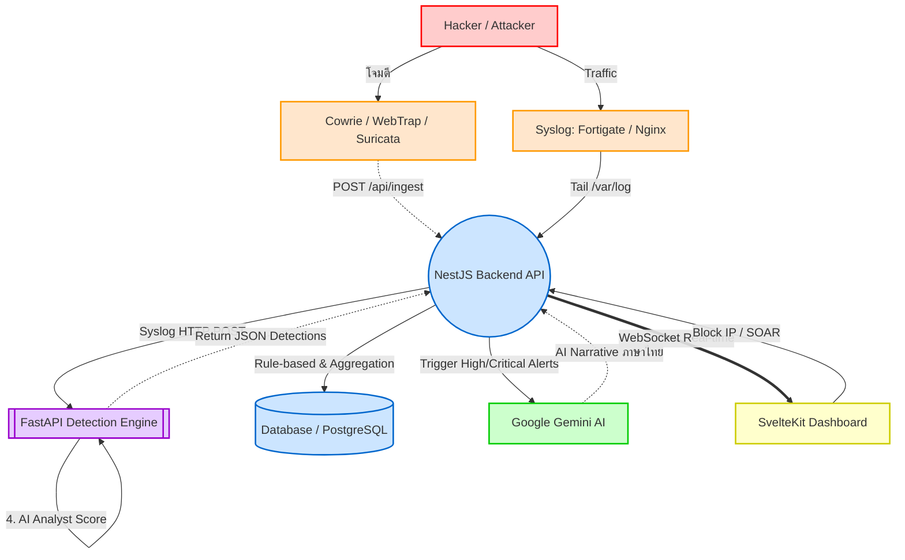

# 🏗️ KKUSIEM Architecture & Project Structure

ไฟล์นี้อธิบายโครงสร้างโปรเจกต์ (Folder Structure) และสถาปัตยกรรมระบบ (System Architecture) ของ KKUSIEM อย่างละเอียด โดยเน้นการทำงานร่วมกันระหว่าง Backend และ Detection Engine (AI/ML)

---

## 📂 โครงสร้างโฟลเดอร์หลัก (Project Structure)

```text
Demo_Honeypot/
│
├── backend/                     # 🔴 NestJS Backend API & WebSocket (ระบบหลัก)
│   ├── src/
│   │   ├── attacks.controller.ts # CRUD attack, บล็อก IP, จัดการ SOAR
│   │   ├── ingest.controller.ts  # POST /api/ingest — Endpoint หลักสำหรับรับ log (Wazuh, Cowrie, WebTrap)
│   │   ├── log.service.ts        # ⚙️ Data Flow Controller (รับข้อมูล -> กรอง -> ส่ง Detection Engine -> เซฟลง DB)
│   │   ├── ai.service.ts         # ประสานงานกับ LLM (Gemini) เพื่อทำ Narrative สรุปเหตุการณ์
│   │   ├── events.gateway.ts     # Real-time WebSocket (Socket.io)
│   │   └── ...                   # ส่วนอื่นๆ เช่น Auth, Entities, Config
│   └── .env
│
├── detection-engine/            # 🧠 AI/ML Engine (FastAPI) [หัวใจสำคัญของการตรวจจับอัจฉริยะ]
│   ├── api/                     # FastAPI Endpoints
│   ├── parsers/                 # แปลง Log หลายฟอร์แมต (Firewall, Nginx, Server) ให้อยู่ในรูปแบบมาตรฐาน
│   ├── core/                    # ฟิลเตอร์พื้นฐาน (เช่น IP Filter)
│   ├── features/                # การสร้าง Feature Vector สำหรับ Machine Learning
│   ├── engine/ml/               # โมเดล ML สำหรับตรวจจับ: Isolation Forest (Anomaly) และ XGBoost
│   ├── fusion/                  # AI Analyst (LLM Mock / Scoring) จัดกลุ่มและออก Report
│   └── main.py                  # จุดศูนย์กลางในการรับ POST /api/v1/ingest
│
├── frontend/                    # 🟢 SvelteKit Frontend Dashboard
│   ├── src/
│   │   ├── lib/components/      # UI (กราฟ, ตาราง, โมดอล AI)
│   │   ├── routes/dashboard/    # หน้าแผงควบคุมหลัก
│   │   └── stores/events.ts     # เก็บ State และจัดการ WebSocket กับ Backend
│   └── .env
│
├── honeypots/                   # 🪤 ระบบล่อลวง (Decoys)
│   ├── cowrie/                  # SSH/Telnet Honeypot (ยิง log เป็น JSON ไปยัง Backend)
│   └── webtrap/                 # ดักจับ Web-based Attacks
│
├── nginx/                       # 🛡️ Reverse Proxy + SSL config (Production)
└── docker-compose.yml           # ไฟล์รันทุกเซอร์วิสเข้าด้วยกัน
```

---

## 📐 สถาปัตยกรรมระบบ (System Architecture)

ระบบถูกออกแบบด้วยสถาปัตยกรรมแบบกระจายศูนย์ที่แบ่งแยกหน้าที่ชัดเจน: **Backend** จัดการข้อมูล (Routing/DB/WebSocket) ในขณะที่ **Detection Engine** รับหน้าที่เป็นสมองวิเคราะห์ (AI/ML)



### 🧠 เจาะลึกการทำงานของ Detection Engine (Python/FastAPI)
`detection-engine` เป็นตัววิเคราะห์ข้อมูล Log ที่ไม่มีโครงสร้างชัดเจน (เช่น Syslog) โดยเฉพาะ ซึ่ง Backend (`log.service.ts`) จะส่งข้อมูลมาให้ผ่าน `POST /api/v1/ingest` Engine นี้มี Pipeline ดังนี้:

1. **Parsers (`parsers/`)**: ทำการแยกวิเคราะห์ (Parsing) Log จากแหล่งกำเนิดต่างๆ เช่น Firewall หรือ Web Server เพื่อให้ได้โครงสร้างที่เป็นมาตรฐาน (Normalized Event)
2. **IP Filter (`core/ip_filter.py`)**: ตรวจสอบว่าเป็น IP โจมตีจากภายนอกหรือไม่ (ตัด Local IP ทิ้ง)
3. **Feature Aggregator (`features/`)**: รวบรวมสถิติและลักษณะพฤติกรรม (Behavioral Features) ของ IP ภายในหน้าต่างเวลาที่กำหนด (เช่น 5 นาที)
4. **AI Screening (`engine/ml/`)**: 
   - ใช้ **Isolation Forest** กรองเหตุการณ์ปกติออกไปเพื่อลดภาระ
   - ใช้ **XGBoost Classifier** ช่วยจำแนกประเภทความเสี่ยงขั้นสูง
   - ใช้ **LogLLM** ตรวจสอบพฤติกรรมทาง Semantic
5. **AI Analyst Fusion (`fusion/`)**: ประเมินผลลัพธ์จากโมเดลทั้งหมด ให้คะแนน (Risk Score) สรุปเป็น Incident ส่งกลับไปให้ Backend บันทึก

### ⚙️ กระบวนการทำงานใน Backend (`log.service.ts`)
1. **Ingest Endpoint**: สำหรับ Honeypot/IDS ที่มีการจัดรูปแบบมาแล้ว (JSON) จะถูกส่งเข้า `POST /api/ingest` เพื่อประมวลผลด้วย Rule-based Engine 
2. **File Tailing**: สำหรับ Syslog (เช่น `/var/log/firewall`) Backend จะทำหน้าที่คอยอ่านบรรทัดใหม่และส่งไปวิเคราะห์ที่ `Detection Engine` (พอร์ต 8100) ทันที
3. **Aggregation Cache**: ข้อมูลผลลัพธ์จะถูกนำมารวมกลุ่ม (Aggregate) ในช่วงเวลาสั้นๆ ป้องกันการบันทึกฐานข้อมูลซ้ำซ้อน
4. **WebSocket Broadcast**: ส่งข้อมูลที่ผ่านการบันทึก (หรือการวิเคราะห์แล้ว) ไปที่ Dashboard ทันที
5. **AI Narrative Layer**: เรียกใช้ Generative AI (เช่น Gemini) เพื่อเขียนสรุปภาษาไทย สำหรับ Event ระดับ High/Critical เท่านั้น เพื่อไม่ให้เปลืองโควต้าและไม่ให้ระบบโดยรวมทำงานช้าลง

---

## 🧪 คำแนะนำการพัฒนา (Development Conventions)

### 📏 การแก้ไขโค้ด
- **Backend (NestJS):** ทุก Service และ Controller ออกแบบมาให้ทำงานแบบ Asynchronous หลีกเลี่ยงการเขียนโค้ดที่ Block Event Loop
- **Detection Engine (FastAPI):** เขียนเป็น Python Pipeline ถ้าต้องการเพิ่มโมเดล ML ใหม่ ให้สร้างคลาสในโฟลเดอร์ `engine/ml/` และนำไปเชื่อมต่อที่ขั้นตอน Fusion
- **Frontend (SvelteKit):** การแสดงผลกราฟต่างๆ ดึงข้อมูลแบบ Real-time ผ่าน `eventsStore` (ดูที่ `frontend/src/stores/events.ts`)

### 🐳 การทดสอบด้วย Docker Compose
โปรเจกต์นี้ตั้งค่า `docker-compose.yml` เพื่อให้ทุก Service เชื่อมต่อกันผ่าน Network จำลองของ Docker:
- `backend` เรียกใช้ `postgres` และ `redis`
- `nginx` ทำหน้าที่เป็น Gateway จัดการ WebSocket ให้วิ่งเข้าหา `backend:5000`
- `detection-engine` ถูกเปิดพอร์ตภายในไว้รับข้อมูลจาก `backend`

> **Note:** หากต้องการทำ Load Testing หรือทดสอบการรับ Log ปริมาณมาก แนะนำให้ตรวจสอบฟังก์ชัน `Aggregation` ภายใน `log.service.ts` เพื่อป้องกันฐานข้อมูลทำงานหนักเกินไป
