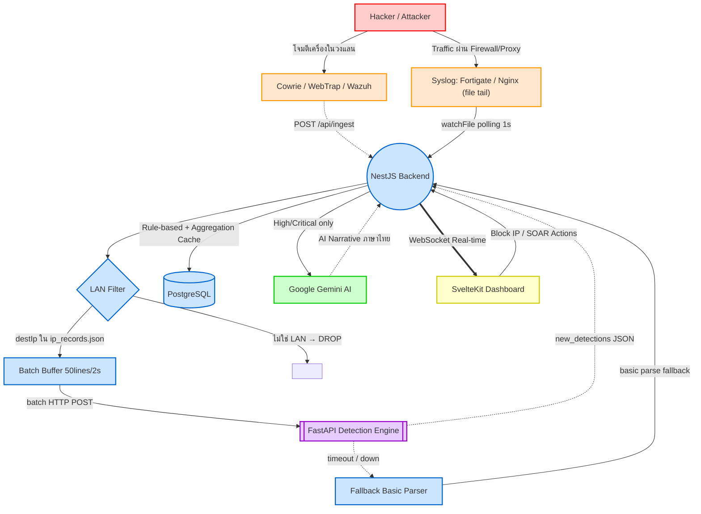

# 🏗️ KKUSIEM Architecture & Project Structure

ไฟล์นี้อธิบายโครงสร้างโปรเจกต์ สถาปัตยกรรม และหลักการทำงานของ KKUSIEM อย่างละเอียด สำหรับนักพัฒนาหรือ AI Agent ที่จะทำงานบนโค้ดนี้

---

## 📂 โครงสร้างโฟลเดอร์หลัก (Project Structure)

```text
Demo_Honeypot/
│
├── backend/                     # 🔴 NestJS Backend API & WebSocket (ระบบหลัก)
│   ├── src/
│   │   ├── attacks.controller.ts  # CRUD attack, บล็อก IP, จัดการ SOAR
│   │   ├── ingest.controller.ts   # POST /api/ingest — Endpoint รับ log ทุกต้นทาง
│   │   ├── log.service.ts         # ⚙️ Core Engine: Ingest → LAN Filter → Batch → DB → WebSocket
│   │   ├── network-map.service.ts # 🗺️ LAN subnet matching จาก ip_records.json
│   │   ├── ai.service.ts          # Gemini LLM สรุปเหตุการณ์ภาษาไทย
│   │   ├── events.gateway.ts      # Real-time WebSocket (Socket.io)
│   │   ├── ip_records.json        # 644 subnet records ของวงแลน KKU
│   │   └── entities/attack.entity.ts  # Schema ตาราง attacks ใน PostgreSQL
│   └── .env
│
├── detection-engine/            # 🧠 AI/ML Engine (FastAPI)
│   ├── api/                     # FastAPI Endpoints (POST /api/v1/ingest)
│   ├── parsers/                 # แปลง Log หลายฟอร์แมต (Firewall, Nginx) ให้เป็นมาตรฐาน
│   ├── core/                    # IP Filter และ Core Logic
│   ├── features/                # Feature Aggregation สำหรับ ML
│   ├── engine/ml/               # Isolation Forest + XGBoost Classifier
│   ├── fusion/                  # AI Analyst Fusion (Risk Score + Incident Generation)
│   └── main.py                  # Entry point
│
├── frontend/                    # 🟢 SvelteKit Dashboard
│   ├── src/
│   │   ├── lib/components/      # UI Components (กราฟ, ตาราง, AI Modal)
│   │   ├── routes/dashboard/    # หน้า Dashboard หลัก
│   │   ├── routes/networkmap/   # หน้าจัดการ LAN subnet (ip_records.json)
│   │   └── stores/events.ts     # State Management + WebSocket
│   └── .env
│
├── honeypots/
│   ├── cowrie/                  # SSH/Telnet Honeypot → ส่ง JSON ไปที่ POST /api/ingest
│   └── webtrap/                 # HTTP Honeypot → ดักจับ Web Attacks
│
├── nginx/                       # Reverse Proxy + SSL (Production)
├── logrotate.conf               # Log rotation: hourly, create+postrotate (ไม่ใช้ copytruncate)
└── docker-compose.yml           # Deploy ทุก Service พร้อมกัน
```

---

## 📐 สถาปัตยกรรมระบบ (System Architecture)


```mermaid
graph TD
    classDef attacker fill:#ffcccc,stroke:#ff0000,stroke-width:2px;
    classDef source fill:#ffe6cc,stroke:#ff9900,stroke-width:2px;
    classDef backend fill:#cce5ff,stroke:#0066cc,stroke-width:2px;
    classDef engine fill:#e6ccff,stroke:#9900cc,stroke-width:2px;
    classDef llm fill:#ccffcc,stroke:#00cc00,stroke-width:2px;
    classDef frontend fill:#ffffcc,stroke:#cccc00,stroke-width:2px;

    A[Hacker / Attacker]:::attacker
    B1[Cowrie / WebTrap / Wazuh]:::source
    B2["Syslog: Fortigate / Nginx (file tail)"]:::source

    C((NestJS Backend)):::backend
    LAN{LAN Filter}:::backend
    BATCH[Batch Buffer 50lines/2s]:::backend
    D[[FastAPI Detection Engine]]:::engine
    FB[Fallback Basic Parser]:::backend
    E[(PostgreSQL)]:::backend
    F[Google Gemini AI]:::llm
    G[SvelteKit Dashboard]:::frontend

    A -->|โจมตีเครื่องในวงแลน| B1
    A -->|Traffic ผ่าน Firewall/Proxy| B2

    B1 -.->|POST /api/ingest| C
    B2 -->|watchFile polling 1s| C

    C --> LAN
    LAN -->|destIp ใน ip_records.json| BATCH
    LAN -->|ไม่ใช่ LAN → DROP| X[ ]

    BATCH -->|batch HTTP POST| D
    D -.->|new_detections JSON| C
    D -.->|timeout / down| FB
    FB -->|basic parse fallback| C

    C -->|Rule-based + Aggregation Cache| E
    C -->|High/Critical only| F
    F -.->|AI Narrative ภาษาไทย| C

    C == WebSocket Real-time ==> G
    G -->|Block IP / SOAR Actions| C
```

---

## ⚙️ การทำงานของ `log.service.ts` (Core Engine)

### Data Flow ทั้งหมด

```
[Source: Cowrie/Wazuh/WebTrap]
    → POST /api/ingest
    → ingestLog()
    → processXxx() (per-source rule-based processor)
    → saveAndBroadcast()
         ├─ LAN Filter (drop ถ้า destIp ไม่ใน LAN)
         ├─ Kill Chain & Severity Classifier
         ├─ Aggregation Cache (dedup ใน 1 นาที)
         ├─ attackRepository.save() → PostgreSQL
         └─ eventsGateway.broadcastAttack() → WebSocket → Dashboard

[Source: Fortigate Syslog / Nginx revproxy]
    → startFileTail() watchFile polling ทุก 1 วิ
    → processSyslogMessage()
         └─ LAN Filter (ตรวจ IP ทุกตัวในบรรทัด)
         └─ queueLineForDetection()
              └─ logBatchBuffer (สูงสุด 50 lines)
                   └─ flushBatchToDetectionEngine() ทุก 2 วิ
                        ├─ axios.post detection-engine:8100 → ingestLog() [ปกติ]
                        └─ ingestRawLineAsFallback() [ถ้า AI ไม่ตอบ]
```

### Cron Jobs ที่รันอยู่เสมอ

| Schedule | Method | หน้าที่ |
|----------|--------|---------|
| ทุก 5 นาที | `cleanupStaleCaches()` | GC: ล้าง aggregationCache, ipStats, cap sessionToIpMap ≤ 500 |
| ทุกเที่ยงคืน | `pruneOldLogs()` | ลบ Log เกิน 30 วัน จาก PostgreSQL |

### In-Memory State (และขอบเขต)

| Map/Cache | Key | ขอบเขต/TTL | หมายเหตุ |
|-----------|-----|-----------|---------|
| `aggregationCache` | `${ip}-${type}` | 5 นาที (GC) | Dedup attack events |
| `ipStats` | IP address | 5 นาที (GC) | นับครั้ง brute force |
| `sessionToIpMap` | Cowrie session ID | cap 500 (FIFO) | เชื่อม Cowrie session กับ real IP |
| `blockedIpsCache` | — | 1 นาที (TTL) | Cache blocked_ips.json |
| `logBatchBuffer` | — | flush ทุก 2 วิ หรือ 50 lines | Buffer ก่อนส่ง Detection Engine |

---

## 🗺️ การทำงานของ LAN Filter

### Logic ใน `saveAndBroadcast()`

```typescript
const isLanDest   = networkMapService.isInLan(destIp);    // เป้าหมายใน LAN?
const isLanSensor = networkMapService.isInLan(sensorIp);   // sensor ของเราใน LAN?

const isRelevant  = isLanDest || (!destIp && isLanSensor);
if (!isRelevant) return; // DROP
```

### Logic ใน `processSyslogMessage()` (สำหรับ file tail)

```typescript
// ตรวจ IP ทุกตัวในบรรทัด log — ถ้าไม่มีตัวใดอยู่ใน LAN → drop ตั้งแต่ต้น
const ips = logString.match(/\b(?:[0-9]{1,3}\.){3}[0-9]{1,3}\b/g) || [];
const isLanRelated = ips.some(ip =>
  ip !== '127.0.0.1' && ip !== '0.0.0.0' && networkMapService.isInLan(ip)
);
if (!isLanRelated) return;
```

### `isInLan()` Edge Cases (network-map.service.ts)

| IP | ผลลัพธ์ | เหตุผล |
|----|---------|--------|
| `0.0.0.0` | `false` | Wazuh fallback — ไม่ใช่ IP จริง |
| `127.0.0.1` | `true` | Localhost Honeypot sensor — ต้องผ่าน |
| `10.x.x.x` (ใน records) | `true` | IP ในวง KKU LAN |
| IP ต่างประเทศ | `false` | ภายนอก LAN |

### Field ที่โชว์บน Dashboard

| Field | ค่า | ความหมาย |
|-------|-----|---------|
| `ip` | เช่น `185.220.101.45` | **IP ผู้โจมตี** (attacker) |
| `destIp` | เช่น `10.101.104.234` | **IP เครื่องเหยื่อ** ในวงแลน |
| `organization` | เช่น `คณะแพทย์` | หน่วยงานของเครื่องเหยื่อ (lookup จาก destIp) |
| `country` | เช่น `Russia` | ประเทศผู้โจมตี (GeoIP) |

---

## 🔧 Processors แต่ละต้นทาง

| Source | Processor | Field สำคัญที่แมป |
|--------|-----------|-----------------|
| `cowrie` | `processCowrieLine()` | `src_ip` → attacker, `destIp='10.101.104.234'` |
| `webtrap` | `processWebTrapLine()` | `src_ip` → attacker, `destIp='10.101.104.234'` |
| `wazuh` / `suricata` | `processWazuhAlert()` | `data.srcip` → attacker, `destIp=agent.ip` |
| `firewall` (forti) | `ingestRawLineAsFallback()` | parse `srcip=` / `dstip=` จาก syslog line |
| `nginx` (reproxy) | `ingestRawLineAsFallback()` | parse `client=` / `for=` จาก nginx log |
| generic | `processGenericLog()` | `src_ip`, `dest_ip` fields |

---

## 🐛 Known Issues & Gotchas

### การแก้ไขโค้ดใน `log.service.ts`
ไฟล์นี้มี **Unicode box-drawing characters** (`──`, `─`) ในบรรทัด comment ทำให้ `replace_file_content` tool ใน IDE บางตัวล้มเหลว  
**ต้องใช้ PowerShell Get-Content -Raw + .Replace() + Set-Content -NoNewline เท่านั้น**

```powershell
$src = "...\backend\src\log.service.ts"
$content = Get-Content $src -Raw -Encoding UTF8
$content = $content.Replace($oldStr, $newStr)
Set-Content $src -Value $content -NoNewline -Encoding UTF8
```

### logrotate.conf — ห้ามใช้ `copytruncate`
`startFileTail()` ใช้ `watchFile + createReadStream` **ไม่ได้ lock file descriptor** → ไม่ต้องการ `copytruncate`  
การใช้ `copytruncate` จะทำให้ log ถูก ingest **ซ้ำสอง** ในช่วง copy window  
ปัจจุบันใช้ `create 0644 root root` + `postrotate: pkill -HUP rsyslog`

### Detection Engine — Single Point of Failure
ถ้า `detection-engine` container ลง → log จาก file tail จะเข้า **Fallback Mode** ไม่หายไป  
Fallback ใช้ regex parse `srcip=`, `dstip=` จาก raw log line แล้ว ingest เข้า DB ตรงๆ

---

## 🧪 Development Conventions

### Backend (NestJS)
- ทุก method ที่ I/O-bound ต้องเป็น `async/await` ห้าม block Event Loop
- ห้ามใช้ `require()` ใน function body — ใช้ top-level `import` เสมอ
- การเพิ่ม Log Source ใหม่: เพิ่ม `case` ใน `ingestLog()` switch และสร้าง `processXxx()` ใหม่ พร้อมตั้ง `destIp` ให้ครบ

### Detection Engine (FastAPI / Python)
- เพิ่มโมเดล ML ใหม่: สร้างคลาสใน `engine/ml/` แล้วเชื่อมที่ `fusion/`
- Response format ที่ Backend คาดหวัง: `{ new_detections: [ { attack_type, risk_score, source_ips, dest_ips, ioc } ] }`

### Frontend (SvelteKit)
- การแสดงผล Real-time ผ่าน `eventsStore` (`frontend/src/stores/events.ts`)
- Network Map จัดการ subnet ผ่าน UI → ไฟล์ `ip_records.json` ถูก reload เมื่อ Backend restart

### Docker Compose
- `backend` → `postgres`, `redis`
- `nginx` → Gateway WebSocket ไปหา `backend:5000`
- `detection-engine` → รับ HTTP จาก `backend` ที่ port 8100 (internal only)
- Backend Node.js heap จำกัด 512MB: `NODE_OPTIONS=--max-old-space-size=512`

> **Performance Note:** Aggregation Cache dedup attack events ในหน้าต่าง 1 นาที (update DB ทุก 5 hits) ทำให้ DB ไม่โดน write storm จาก brute force ปริมาณสูง
